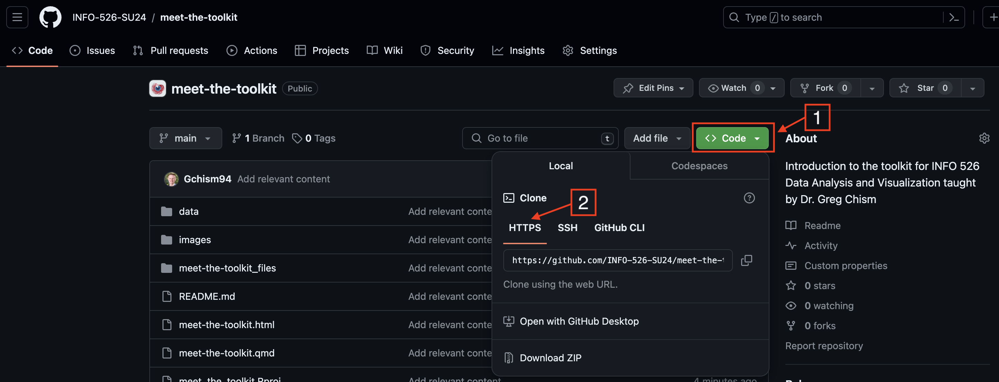

# Meet the Toolkit

This repo contains the material for our first code-along. To proceed, you need to install all the software on your machine. You can find the instructions on our course website: <https://datavizaz.org/guides/install.html>.

This repo contains the files and folders:

-   `README.md`: the current file
-   `meet_the_toolkit.Rproj`: the RStudio project file
-   `meet-the-toolkit.qmd`: the Quarto markdown document (main file with analysis)
-   `meet-the-toolkit.html`: HTML file with the output from `meet-the-toolkit.qmd`
-   `.gitignore`: internal file which controls the files that are tracked in version control
-   `data/un_votes.csv`: dataset in comma separated values format
-   `images`: subfolder with images by files in the repo
-   `meet-the-toolkit_files`: subfolder with files for HTML output document

Your first step should be to clone the repository onto your machine. This is how you can do it:

### How to load the project into RStudio

#### 1. Get the URL of the repo

Scroll to the top of the page. Click on the green `Code` button and copy the HTTPS link for the repo by clicking on the clipboard icon.

#### 2. Import the repository in RStudio

1.  Open RStudio and select `File` \> `New Project` \> `Version Control` \> `Git`.

2.  In the final window, paste the repo URL you grabbed from GitHub in the `Repository URL` window. Click on `Browse` to select the folder on your computer where you want to store the project. I suggest you set up a folder on your computer for all the class content and always use this as a destination to store your material for the course.

3.  Click on `Create Project`.

If everything worked fine, you should now have a folder `meet-the-toolkit` in the folder our selected when cloning the project.

For in-class material, you will normally be granted permission to pull files (i.e. clone or download) and not upload them.
